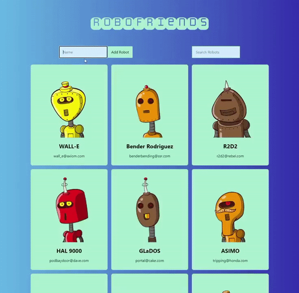

# RoboFriends
A web apllication developed with React/JavaScript that generate a robot based on the user's input name using RoboHash API. The API will take in a string and hash it, then generate a robot based on that hash. React Hook and Redux implemented.

- Try adding your name or a celebrity's name and see what you would look like as a robot.
- The search box allows you to filter the robots by name. Try adding your family in and filter by last name to see if the robots have anything in common.
- Switch mode button will let you switch over to AlienFriends.

Try it out:

https://ctran20.github.io/RoboFriends/
